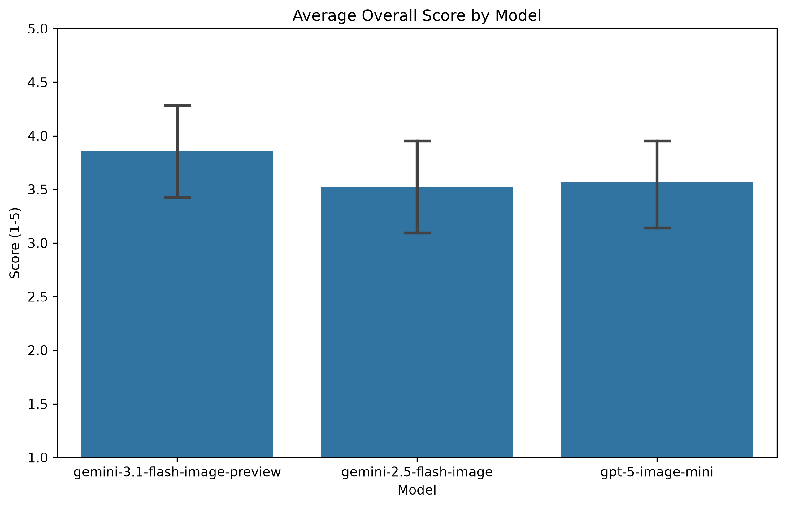
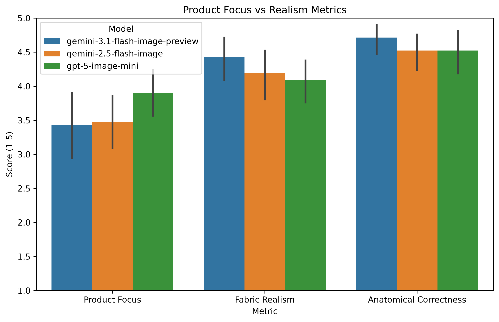

# 🎨 AI Image Evaluation Platform

> **Benchmarking AI image generation models for Indian E-commerce Fashion Photography**

🚀 **Live Deployment:** [https://ai-image-eval-frontend.onrender.com/](https://ai-image-eval-frontend.onrender.com/)

A full-stack human evaluation platform that measures how well state-of-the-art image generation models — **GPT-5-Image-Mini**, **Gemini 2.5 Flash**, and **Gemini 3.1 Flash Preview** — perform on prompts specifically crafted for Indian fashion e-commerce.

Participants rate each generated image across **10 criteria** including cultural authenticity, fabric realism, anatomical correctness, and commercial viability. This system provides a full pipeline from programmatic image generation to blind randomized human evaluation, resulting in statistically significant insights into model performance.

---

## 🧪 Benchmark Showcase

Two representative prompts are shown below. Each was sent to all three models and independently rated by human evaluators on a 1–5 scale.

### Prompt 1 — Bridal Lehenga Showcase

> *"Close-up of a modern Indian bride wearing a pastel lehenga with intricate zari work, soft glowing wedding decor in the background, studio lighting, highly detailed"*

| | GPT-5-Image-Mini | Gemini 2.5 Flash | Gemini 3.1 Flash Preview |
|---|---|---|---|
| **Output** |  |  |  |
| Prompt Adherence | 4 | 5 | 5 |
| Visual Quality | 5 | 5 | 5 |
| Indian Cultural Relevance | 5 | 5 | 5 |
| Commercial Viability | 3 | 4 | 5 |
| Product Focus | 3 | 4 | 5 |
| Anatomical Correctness | 5 | 5 | 5 |
| Lighting Consistency | 4 | 4 | 4 |
| Fabric & Texture Realism | 5 | 5 | 5 |
| Demographic Authenticity | 4 | 4 | 5 |
| **Overall Score** | **4 / 5** | **4 / 5** | **5 / 5** 🏆 |

---

### Prompt 2 — South Indian Traditional

> *"A graceful South Indian woman in a green Kanjeevaram saree with gold jewelry, traditional temple architecture in the background, cinematic lighting, 8k"*

| | GPT-5-Image-Mini | Gemini 2.5 Flash | Gemini 3.1 Flash Preview |
|---|---|---|---|
| **Output** |  |  |  |
| Prompt Adherence | 5 | 5 | 5 |
| Visual Quality | 3 | 5 | 5 |
| Indian Cultural Relevance | 5 | 5 | 5 |
| Commercial Viability | 4 | 4 | 4 |
| Product Focus | 5 | 4 | 4 |
| Anatomical Correctness | 5 | 4 | 5 |
| Lighting Consistency | 3 | 3 | 5 |
| Fabric & Texture Realism | 4 | 5 | 5 |
| Demographic Authenticity | 4 | 3 | 5 |
| **Overall Score** | **4 / 5** | **4 / 5** | **5 / 5** 🏆 |

---

## 📊 Evaluation Criteria

Each image is scored on 10 dimensions:

| Criterion | Description |
|---|---|
| **Prompt Adherence** | How faithfully the image follows the text prompt |
| **Visual Quality** | Sharpness, resolution, and overall aesthetic |
| **Indian Cultural Relevance** | Accuracy of Indian fashion, styling, and context |
| **Commercial Viability** | Suitability for real-world e-commerce catalogues |
| **Product Focus** | How well the clothing/product is featured |
| **Anatomical Correctness** | Natural human poses, proportions, and features |
| **Lighting Consistency** | Realistic and consistent light sources |
| **Fabric & Texture Realism** | Believable fabric drape, sheen, and texture |
| **Demographic Authenticity** | Authentic representation of Indian demographics |
| **Overall Impression** | Holistic quality score |

---

## 🔍 Evaluation Pipeline & Methodology

### Why We Chose This Evaluation
We selected E-commerce photography for the Indian market because high-quality, culturally accurate product visuals are the single largest conversion driver in digital retail. Small-to-medium D2C (Direct to Consumer) brands in India often cannot afford professional, high-end catalog shoots for diverse demographics, making AI generation incredibly valuable.

**Why it matters for India and AI Labs:**
India is not a monolith. "Indian clothing" is highly regional, fabric-specific, and occasion-specific (e.g., Kanjeevaram sarees vs. Navratri chaniya cholis). For an AI lab building tools for this market, simply generating a "brown person in a colorful dress" is a failure. The model must grasp fabric textures (zari work, silk draping), anatomically correct demographic representation, and commercially viable aesthetics. 

This evaluation tests exactly that: the intersection of **cultural authenticity** and **commercial utility**.

### How the Evaluation Works
1. **Prompt Engineering:** We curated a benchmark set of highly specific prompts spanning various E-commerce fashion use cases (Bridal, Casual Ethnic, Office Wear Saree).
2. **Asynchronous Generation:** The backend uses a Unified Provider Interface to trigger all three models (OpenAI, Gemini 2.5, Gemini 3.1) simultaneously. All API integration logic is completely decoupled from the UI.
3. **Blind Evaluation UI:** Participants register via the Streamlit frontend. They are served a blind, randomized sample of images. They do not know which model generated which image, eliminating brand bias.
4. **Data Aggregation:** The backend aggregates these Likert-scale ratings and feeds them back into a live dashboard.

### How Participants Judged Outputs
Each evaluator rated the blind outputs on a **1-5 Likert scale** across specific, rigorous criteria:
- **Prompt Adherence:** Did the model generate the requested product?
- **Visual Quality:** Is the image photorealistic and artifact-free?
- **Indian Cultural Relevance:** Is the styling authentically Indian, or a Western caricature?
- **Commercial Viability:** Could this image actually be used in a live catalog?
- **Product Focus:** Does the product take center stage, or is it lost in the background?
- **Anatomical & Fabric Realism:** Are hands correct? Does silk look like silk?

---

## 📈 Main Findings & Insights

After running the full 60+ image batch and collecting human evaluations, clear distinct model personalities emerged:

### 1. GPT-5 Image Mini: High Product Focus, Low Realism
GPT models excelled at **Product Focus**. The framing of the image is incredibly catalog-friendly, placing the apparel dead-center. 
**The Warning Sign:** The images suffer from an "uncanny valley" effect. They lack fabric realism and look easily recognizable as "AI-generated," which can severely harm consumer trust in an e-commerce context.

### 2. Gemini 2.5 & 3.1 Flash Image: High Realism, Poor Focus
Both Gemini models dominate in **Visual Quality** and **Fabric Realism**. The lighting, skin textures, and cultural nuances (like intricate mehndi or Kanjeevaram borders) are stunningly accurate. 
**The Warning Sign:** The models act too much like artists and not enough like catalog photographers. They focus heavily on elaborate, cinematic backgrounds (e.g., complex Diwali lighting or Rajasthan deserts), which often drowns out the actual product being sold.

### Visualizing the Data
*(The graphs below are generated directly from our human evaluation export)*

#### Overall Score

*While Gemini 3.1 edges out slightly in aggregate, the overall score hides the distinct trade-offs each model makes.*

#### Metric Breakdown: Focus vs. Realism

*Notice how GPT-5 dominates 'Product Focus', while Gemini massively outscores on 'Fabric Realism' and 'Anatomical Correctness'.*

**Key Takeaway for a Busy Reviewer:**
Use **GPT** if you need strict, predictable catalog framing but are willing to edit the textures. Use **Gemini** if you need immediate photorealistic cultural accuracy, but you must prompt aggressively to force a plain studio background.

---

## 🚀 How to Scale

If an AI lab wanted to scale this evaluation to thousands of prompts across dozens of models:
1. **Model Extensibility:** Our `ImageGenerationProvider` ABC (Abstract Base Class) means adding a new model (like Midjourney or Flux) takes less than 20 lines of code. The routing and DB schema do not need to change.
2. **Infrastructure:** The current architecture uses SQLite for portability. Because we use SQLAlchemy 2.0 ORM, swapping to a distributed PostgreSQL cluster requires changing exactly one `DATABASE_URL` environment variable.
3. **Queueing:** For thousands of prompts, we would swap the synchronous `POST /api/generate` loop for a Celery/Redis asynchronous queue to handle vendor rate limits seamlessly.

---

## 🏗️ Architecture

```
┌─────────────────────┐     HTTP      ┌─────────────────────┐
│  Streamlit Frontend  │ ──────────►  │   FastAPI Backend    │
│  (Port 8501)         │              │   (Port 8000)        │
│                      │              │                      │
│  • Home              │              │  • /api/participants │
│  • Evaluate Images   │              │  • /api/generations  │
│  • Generate Images   │              │  • /api/ratings      │
│  • Analytics Dash    │              │  • /api/analytics    │
│  • History           │              │  • /api/prompts      │
└─────────────────────┘              └──────────┬───────────┘
                                                │
                                     ┌──────────▼───────────┐
                                     │  SQLite + File Store  │
                                     │  evaluation.db        │
                                     │  generated_images/    │
                                     └──────────────────────┘
```

---

## 🛠️ Tech Stack

| Layer | Technology |
|---|---|
| Frontend | Streamlit |
| Backend | FastAPI |
| Database | SQLite (SQLAlchemy + Alembic) |
| Image Generation | OpenRouter API (GPT-5-Mini, Gemini 2.5/3.1) |
| Containerization | Docker + Docker Compose |
| Charts | Matplotlib, Seaborn |

---

## 📁 Project Structure

```
ai-image-eval/
├── backend/
│   ├── app/
│   │   ├── api/            # FastAPI route handlers
│   │   ├── models/         # SQLAlchemy DB models
│   │   ├── schemas/        # Pydantic request/response schemas
│   │   └── services/       # Business logic
│   └── alembic/            # DB migrations
├── frontend/
│   └── app/
│       ├── Home.py
│       ├── pages/          # Streamlit multi-page app
│       └── components/     # Shared UI components
├── data/                   # SQLite database (gitignored)
├── generated_images/       # AI-generated images (gitignored)
├── reports/                # Data visualization charts
├── docs/showcase/          # README showcase images
└── docker-compose.yml
```

---

## 💻 Running Locally

**Prerequisites:** Docker + Docker Compose, [OpenRouter](https://openrouter.ai) API key

```bash
git clone https://github.com/ayushk1233/ai-image-eval.git
cd ai-image-eval

# Configure environment
cp .env.example .env
# Edit .env — add your OPENROUTER_API_KEY

# Start both containers
docker compose up -d --build

# Run Initial Database Migrations (First time only)
docker compose exec backend alembic upgrade head
```

- **Frontend:** http://localhost:8501  
- **API Docs:** http://localhost:8000/docs

---

## 🤔 Final Reflections

**1. Why did you choose this eval?**
E-commerce visuals have immediate, measurable ROI. A bad hallucination in text is annoying; a bad hallucination on an e-commerce model loses a sale instantly.

**2. Why is it useful for India?**
India is transitioning to digital retail rapidly, yet generic Western models struggle immensely with the nuances of Indian fabrics, jewelry, and regional aesthetics.

**3. Why would an AI lab building for India care about it?**
Labs need to know their models' weak spots. If Gemini makes beautiful images but fails at "Product Focus" framing, the lab knows to tweak the system prompt for commercial use cases.

**4. What did you learn from running the sample?**
I learned that an "Overall Score" metric is highly misleading. A model can score a 3/5 because it is perfectly framed but looks plastic, while another scores 3/5 because it looks incredibly realistic but the framing is unusable. You must evaluate the component metrics.

**5. What would you improve with more time?**
I would implement an Elo-based blind A/B comparison tool rather than standard Likert scales. Absolute scoring (1-5) suffers from rater fatigue and subjectivity, whereas A/B pairwise comparisons yield mathematically purer rankings.
