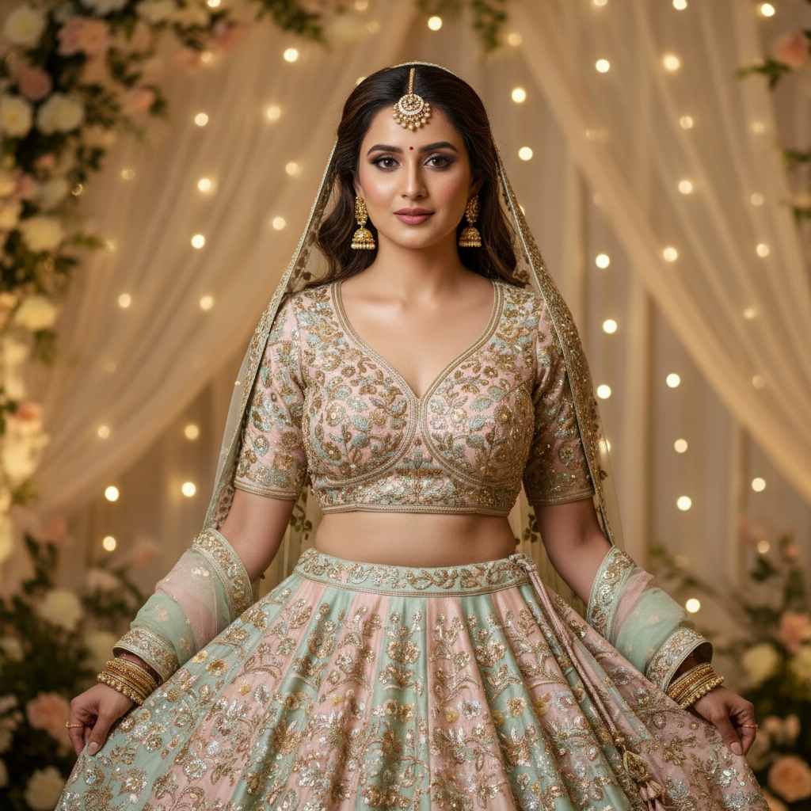
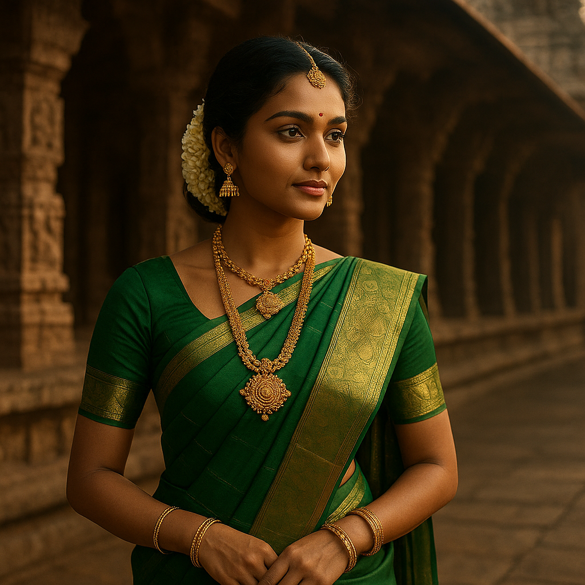
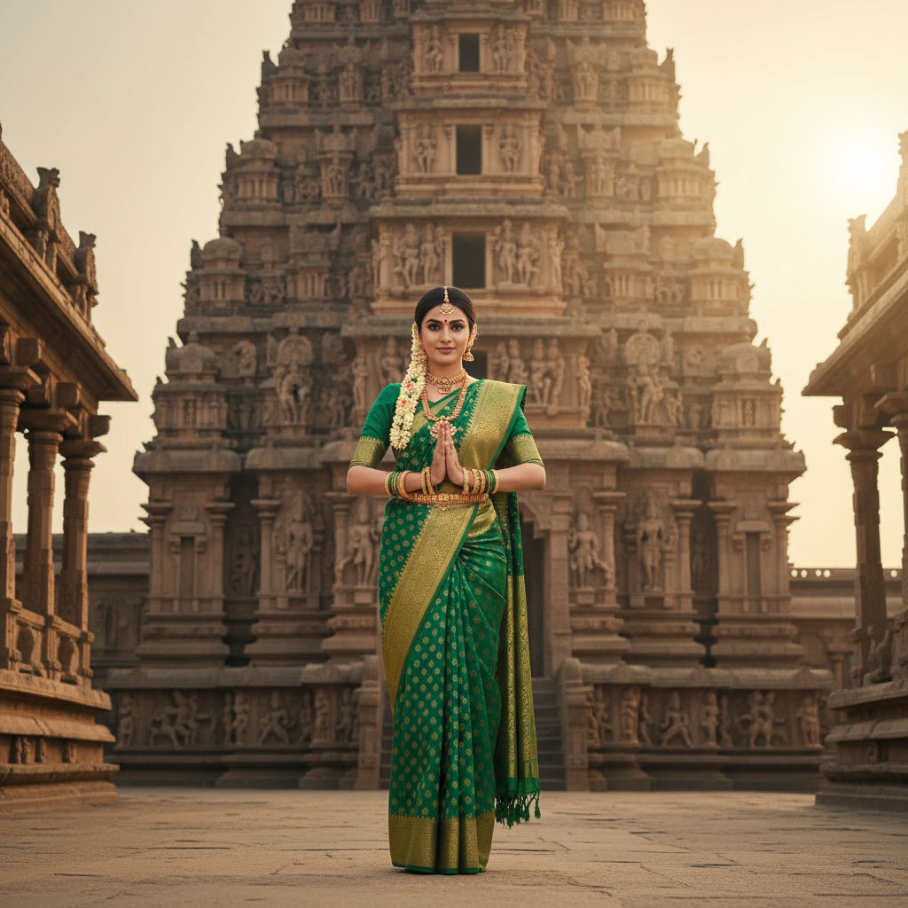

# 🎨 AI Image Evaluation Platform

> **Benchmarking AI image generation models for Indian E-commerce Fashion Photography**

A full-stack human evaluation platform that measures how well state-of-the-art image generation models — **GPT-5-Image-Mini**, **Gemini 2.5 Flash**, and **Gemini 3.1 Flash** — perform on prompts specifically crafted for Indian fashion e-commerce.

Participants rate each generated image across **10 criteria** including cultural authenticity, fabric realism, anatomical correctness, and commercial viability.

---

## 🧪 Benchmark Showcase

Two representative prompts are shown below. Each was sent to all three models and independently rated by human evaluators on a 1–5 scale.

---

### Prompt 1 — Bridal Lehenga Showcase

> *"Close-up of a modern Indian bride wearing a pastel lehenga with intricate zari work, soft glowing wedding decor in the background, studio lighting, highly detailed"*

| | GPT-5-Image-Mini | Gemini 2.5 Flash | Gemini 3.1 Flash Preview |
|---|---|---|---|
| **Output** |  |  |  |
| Prompt Adherence | 4 | 5 | 5 |
| Visual Quality | 5 | 5 | 5 |
| Indian Cultural Relevance | 5 | 5 | 5 |
| Commercial Viability | 3 | 4 | 5 |
| Product Focus | 3 | 4 | 5 |
| Anatomical Correctness | 5 | 5 | 5 |
| Lighting Consistency | 4 | 4 | 4 |
| Fabric & Texture Realism | 5 | 5 | 5 |
| Demographic Authenticity | 4 | 4 | 5 |
| **Overall Score** | **4 / 5** | **4 / 5** | **5 / 5** 🏆 |

---

### Prompt 2 — South Indian Traditional

> *"A graceful South Indian woman in a green Kanjeevaram saree with gold jewelry, traditional temple architecture in the background, cinematic lighting, 8k"*

| | GPT-5-Image-Mini | Gemini 2.5 Flash | Gemini 3.1 Flash Preview |
|---|---|---|---|
| **Output** |  |  |  |
| Prompt Adherence | 5 | 5 | 5 |
| Visual Quality | 3 | 5 | 5 |
| Indian Cultural Relevance | 5 | 5 | 5 |
| Commercial Viability | 4 | 4 | 4 |
| Product Focus | 5 | 4 | 4 |
| Anatomical Correctness | 5 | 4 | 5 |
| Lighting Consistency | 3 | 3 | 5 |
| Fabric & Texture Realism | 4 | 5 | 5 |
| Demographic Authenticity | 4 | 3 | 5 |
| **Overall Score** | **4 / 5** | **4 / 5** | **5 / 5** 🏆 |

---

## 📊 Evaluation Criteria

Each image is scored on 10 dimensions:

| Criterion | Description |
|---|---|
| **Prompt Adherence** | How faithfully the image follows the text prompt |
| **Visual Quality** | Sharpness, resolution, and overall aesthetic |
| **Indian Cultural Relevance** | Accuracy of Indian fashion, styling, and context |
| **Commercial Viability** | Suitability for real-world e-commerce catalogues |
| **Product Focus** | How well the clothing/product is featured |
| **Anatomical Correctness** | Natural human poses, proportions, and features |
| **Lighting Consistency** | Realistic and consistent light sources |
| **Fabric & Texture Realism** | Believable fabric drape, sheen, and texture |
| **Demographic Authenticity** | Authentic representation of Indian demographics |
| **Overall Impression** | Holistic quality score |

---

## 🏗️ Architecture

```
┌─────────────────────┐     HTTP      ┌─────────────────────┐
│  Streamlit Frontend  │ ──────────►  │   FastAPI Backend    │
│  (Port 8501)         │              │   (Port 8000)        │
│                      │              │                      │
│  • Home              │              │  • /api/participants │
│  • Evaluate Images   │              │  • /api/generations  │
│  • Generate Images   │              │  • /api/ratings      │
│  • Analytics Dash    │              │  • /api/analytics    │
│  • History           │              │  • /api/prompts      │
└─────────────────────┘              └──────────┬───────────┘
                                                │
                                     ┌──────────▼───────────┐
                                     │  SQLite + File Store  │
                                     │  evaluation.db        │
                                     │  generated_images/    │
                                     └──────────────────────┘
```

---

## 🚀 Running Locally

**Prerequisites:** Docker + Docker Compose, [OpenRouter](https://openrouter.ai) API key

```bash
git clone https://github.com/ayushk1233/ai-image-eval.git
cd ai-image-eval

# Configure environment
cp .env.example .env
# Edit .env — add your OPENROUTER_API_KEY

# Start both containers
docker compose up -d --build
```

- **Frontend:** http://localhost:8501  
- **API Docs:** http://localhost:8000/docs

---

## 🛠️ Tech Stack

| Layer | Technology |
|---|---|
| Frontend | Streamlit |
| Backend | FastAPI |
| Database | SQLite (SQLAlchemy + Alembic) |
| Image Generation | OpenRouter API (GPT-5-Mini, Gemini 2.5/3.1) |
| Containerization | Docker + Docker Compose |
| Charts | Matplotlib, Seaborn |

---

## 📁 Project Structure

```
ai-image-eval/
├── backend/
│   ├── app/
│   │   ├── api/            # FastAPI route handlers
│   │   ├── models/         # SQLAlchemy DB models
│   │   ├── schemas/        # Pydantic request/response schemas
│   │   └── services/       # Business logic
│   └── alembic/            # DB migrations
├── frontend/
│   └── app/
│       ├── Home.py
│       ├── pages/          # Streamlit multi-page app
│       └── components/     # Shared UI components
├── data/                   # SQLite database (gitignored)
├── generated_images/       # AI-generated images (gitignored)
├── docs/showcase/          # README showcase images
└── docker-compose.yml
```
